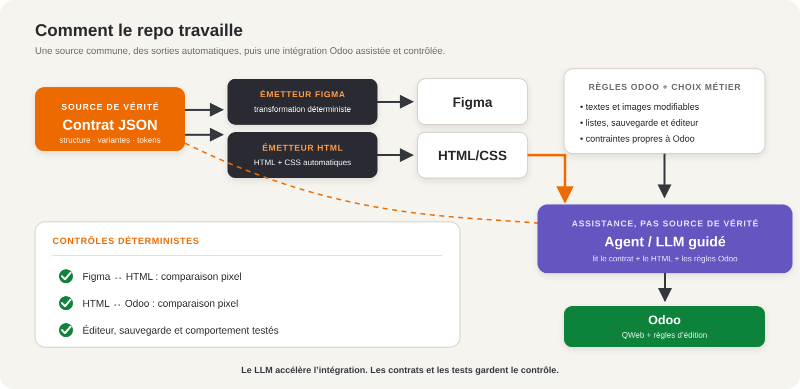

# Figma → contrat → HTML → Odoo

## L’idée en une phrase

**Figma montre le résultat, le contrat JSON fixe les règles, l’émetteur fabrique le HTML/CSS et Odoo rend ce bloc éditable par le client.**



## Le rôle de chaque élément

- **Figma** : la maquette visuelle validée avec le designer.
- **Contrat JSON** : la fiche officielle du composant — nom, textes, variantes, couleurs, espacements et liens entre Figma et le code.
- **Émetteur HTML** : le traducteur qui lit cette fiche et produit le HTML/CSS.
- **Odoo** : la version intégrée dans le site, avec les zones que le client peut modifier.

Le contrat est la référence commune. Il évite que Figma, le HTML et Odoo racontent trois histoires différentes.

## Petit exemple : le bouton

Dans Figma, le designer choisit le style **Default** et le libellé **Contactez-nous**.

Extrait simplifié du vrai contrat [`ds.button`](../contracts/button.contract.json) :

```json
{
  "id": "ds.button",
  "version": "2.0.1",
  "props": [
    {
      "name": "variant",
      "default": "default",
      "bindings": {
        "figma": { "property": "Style" },
        "code": { "prop": "variant" }
      }
    },
    {
      "name": "children",
      "default": "Contactez-nous",
      "bindings": {
        "figma": { "property": "Libelle" },
        "code": { "prop": "children" }
      }
    }
  ]
}
```

L’[émetteur](../core/emit-html.ts) lit ce JSON et produit notamment :

```html
<button class="button button--variant-default">
  <span class="button__label">Contactez-nous</span>
</button>
```

Les couleurs, la police et les espacements deviennent du CSS lié aux mêmes règles. Si une règle change dans le contrat, on régénère le HTML/CSS au lieu de corriger chaque version à la main.

## Est-ce automatique ?

- **Contrat → HTML/CSS** : oui, quand on lance la génération. Ce n’est pas une magie permanente en arrière-plan.
- **Contrat → Figma** : le repo prépare la synchronisation ; une personne la lance puis contrôle le résultat.
- **HTML → Odoo** : réalisé aujourd’hui avec un **agent/LLM guidé**. Il lit le contrat, le HTML de référence et les règles Odoo, puis prépare le QWeb et les zones d’édition.

Le LLM **n’est pas l’émetteur** et ne devient pas la source de vérité. Il accélère l’intégration ; les contrats, les décisions métier et les tests automatiques gardent le contrôle.

## Notre méthode pour passer du HTML à Odoo

1. Valider le composant dans Figma et son contrat.
2. Générer le HTML/CSS de référence.
3. Reprendre ce rendu dans un bloc Odoo.
4. Définir les textes, images ou listes modifiables par le client.
5. Tester la sauvegarde, le mobile et comparer les pixels avec la référence.

## Dépôt d’origine

Ce projet est un fork de [southleft/ds-contracts-poc](https://github.com/southleft/ds-contracts-poc).
