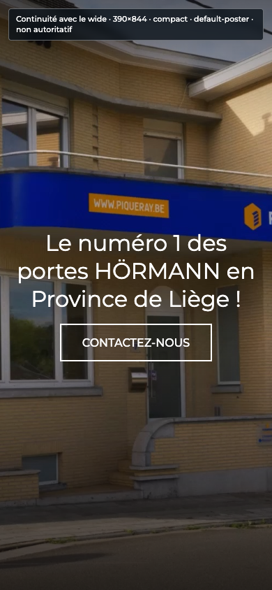
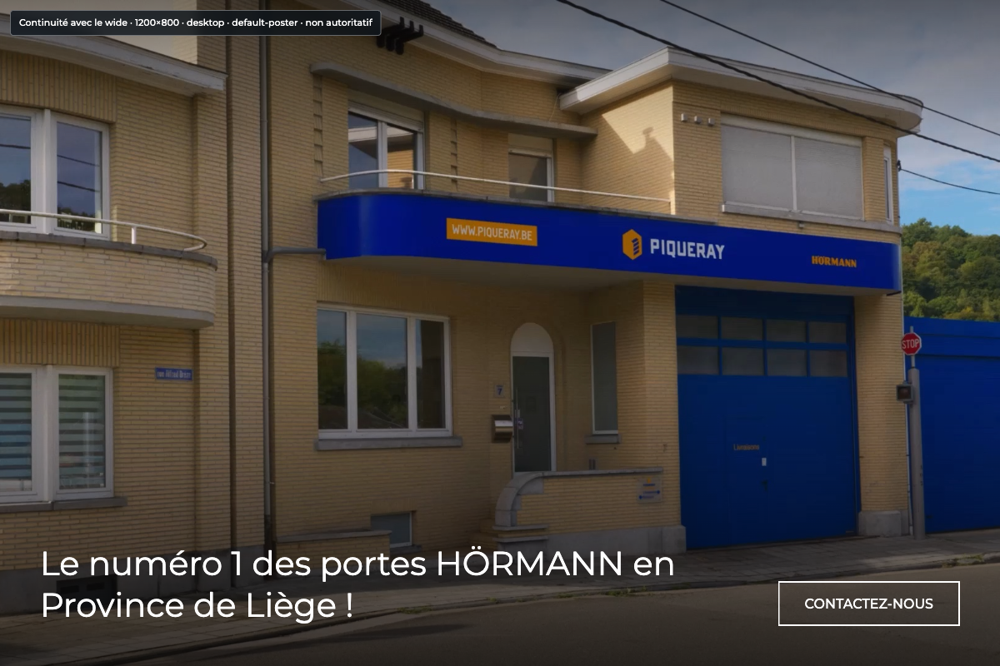
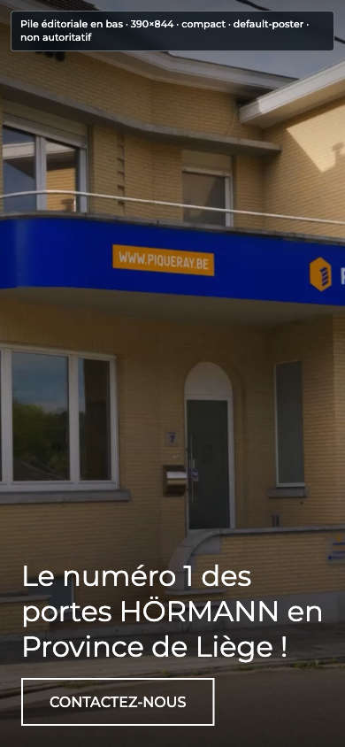
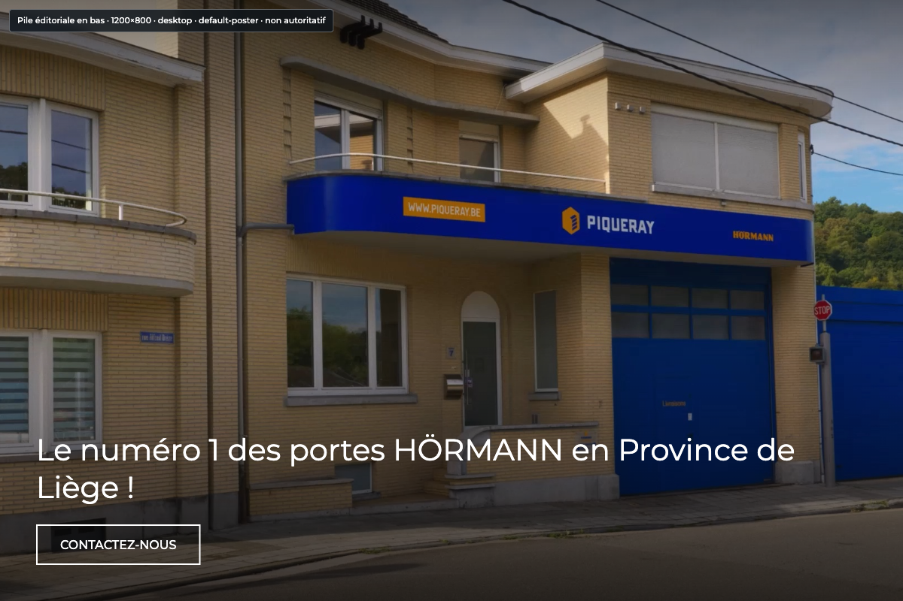
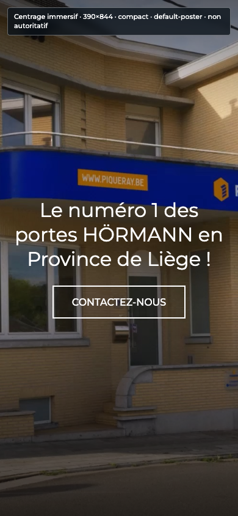
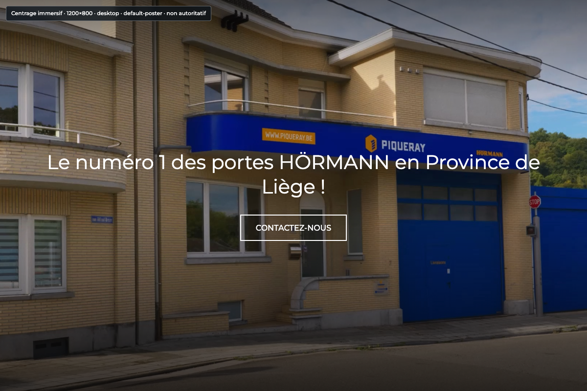

# H2 — Directions de layout responsive HeroVideo

**Autorité :** aide locale non autoritative · **Figma/Page writes :** 0 · **Baseline wide :** H1 accepté

Le profil est fixe : compact `<992`, Desktop `992–1399`, wide `>=1400`. Tablet 834 est un témoin compact, jamais une quatrième composition. Le poster façade, les deux voiles et le Button actuel sont conservés dans toutes les options.

Le [harness visuel local](H2-option-harness.html) permet de changer d’option, de fixture et de largeur. Les aperçus ci-dessous sont des aides à la décision structurelle : leurs tailles de texte, paddings et gaps sont des previews modifiables, jamais une mutation Figma ni une future référence de production.

## Direction owner enregistrée

**Option 3 — Centrage immersif** est retenue pour le layout uniquement : groupe titre–CTA en colonne, centré horizontalement et verticalement en compact et Desktop, puis baseline wide historique. Cette sélection autorise seulement le handoff vers la future spec transverse de fondation et aucune écriture source.

## Règle CTA commune

Le composant Button reste strictement inchangé : variante `Outline blanc`, typographie, padding, icônes et largeur intrinsèque ajustée au texte. HeroVideo décide seulement de son placement et de son alignement. Un éventuel besoin de pleine largeur ou de retour à la ligne est relevé par le cas long, puis différé à la passe transverse du Button.

## Règle typographique commune

Le titre conserve le rôle sémantique `{typography.titre-hero-video}`. Le harness utilise 44/48 comme preview initiale, mais l’agent peut la modifier pour éprouver le layout. Aucune taille simulée n’entre dans H2 ou Figma source ; la future échelle typographique responsive sera décidée globalement, sans substitution locale par `Titre2` ou `Titre3`.

## Règle de spacing commune

Les paddings et gaps affichés servent uniquement à rendre et stress-tester les options. Ils ne sont pas validés dans H2, ne seront pas écrits dans Figma et peuvent varier tant que la direction de layout reste robuste. La future spec transverse décidera entre primitives stables et rôles sémantiques multi-modes à partir de plusieurs composants.

## Comparaison rapide

| Option | Compact | Desktop | Wide | Arbitrage principal |
|---|---|---|---|---|
| **Continuité avec le wide** | column; center/center; titre center; padding preview {space.24}; gap preview {space.16} | row; end/start; titre left; padding preview {space.48}; gap preview {space.24} | Baseline H1 inchangé | La continuité XL est maximale, mais le Desktop 1200 reste plus dense avec le CTA sur la même ligne. |
| **Pile éditoriale en bas** | column; start/end; titre left; padding preview {space.24}; gap preview {space.16} | column; start/end; titre left; padding preview {space.48}; gap preview {space.24} | Baseline H1 inchangé | La robustesse aux contenus longs est maximale, au prix d’un changement de composition visible à 1400px. |
| **Centrage immersif** | column; center/center; titre center; padding preview {space.24}; gap preview {space.24} | column; center/center; titre center; padding preview {space.48}; gap preview {space.24} | Baseline H1 inchangé | La lecture est très claire et homogène, mais s’éloigne le plus de l’ancrage bas du Hero actuel. |

## 1. Continuité avec le wide `continuite-wide`

Compact centré pour la lisibilité ; Desktop conserve la ligne basse du Hero XL avec des valeurs resserrées.

 

| Champ | Compact | Desktop | Wide |
|---|---|---|---|
| Axe | column | row | row historique |
| Alignement | center / center | end / start | end / start historique |
| Titre | center, {typography.titre-hero-video} | left, {typography.titre-hero-video} | Titre Hero vidéo 44/48 |
| Preview spacing — non validé | padding {space.24}, gap {space.16} | padding {space.48}, gap {space.24} | baseline 48/89, gap 10 |
| Faible hauteur | grow-with-content | grow-with-content | baseline |
| Figma explicite | variant | modes | membre historique |

**Arbitrage :**

- La continuité XL est maximale, mais le Desktop 1200 reste plus dense avec le CTA sur la même ligne.

**Limite :**

- Le titre ou CTA exceptionnellement long peut augmenter la hauteur à 1200 ; aucun contenu n’est masqué.

## 2. Pile éditoriale en bas `pile-editoriale`

Titre et CTA restent groupés en bas à gauche en compact et Desktop pour absorber les contenus longs.

 

| Champ | Compact | Desktop | Wide |
|---|---|---|---|
| Axe | column | column | row historique |
| Alignement | start / end | start / end | end / start historique |
| Titre | left, {typography.titre-hero-video} | left, {typography.titre-hero-video} | Titre Hero vidéo 44/48 |
| Preview spacing — non validé | padding {space.24}, gap {space.16} | padding {space.48}, gap {space.24} | baseline 48/89, gap 10 |
| Faible hauteur | grow-with-content | grow-with-content | baseline |
| Figma explicite | variant | variant | membre historique |

**Arbitrage :**

- La robustesse aux contenus longs est maximale, au prix d’un changement de composition visible à 1400px.

**Limite :**

- La pile occupe davantage de hauteur du poster et demande une revue attentive du contraste sur la zone basse.

## 3. Centrage immersif `centre-immersif`

Titre et CTA forment un groupe centré sur le poster jusqu’à 1399px ; le wide historique reste inchangé.

 

| Champ | Compact | Desktop | Wide |
|---|---|---|---|
| Axe | column | column | row historique |
| Alignement | center / center | center / center | end / start historique |
| Titre | center, {typography.titre-hero-video} | center, {typography.titre-hero-video} | Titre Hero vidéo 44/48 |
| Preview spacing — non validé | padding {space.24}, gap {space.24} | padding {space.48}, gap {space.24} | baseline 48/89, gap 10 |
| Faible hauteur | grow-with-content | grow-with-content | baseline |
| Figma explicite | variant | variant | membre historique |

**Arbitrage :**

- La lecture est très claire et homogène, mais s’éloigne le plus de l’ancrage bas du Hero actuel.

**Limite :**

- Le centrage peut recouvrir le point d’intérêt du poster ; aucun recadrage ou second asset n’est autorisé sans nouveau choix owner.

## Probes communes

| Probe | Viewport | Composition attendue | Témoin/frontière |
|---|---:|---|---|
| 320 | 320×640 | compact | contrôle |
| 390 | 390×844 | compact | mobile-390 |
| 834 | 834×1112 | compact | tablet-834 |
| 991 | 991×800 | compact | desktop-start-minus-1 |
| 992 | 992×800 | desktop | desktop-start |
| 993 | 993×800 | desktop | desktop-start-plus-1 |
| 1024 | 1024×800 | desktop | contrôle |
| 1200 | 1200×800 | desktop | desktop-1200 |
| 1399 | 1399×800 | desktop | wide-start-minus-1 |
| 1400 | 1400×800 | wide | wide-start |
| 1401 | 1401×800 | wide | wide-start-plus-1 |
| 1440 | 1440×800 | wide | contrôle |
| 1728 | 1728×720 | wide | wide-1728 |
| short-landscape-844x390 | 844×390 | compact | contrôle |

Cas joués pour chaque option : `default`, `long-title`, `long-cta`, `poster`, `video-unavailable` et `short-landscape-844x390`. Un échec du CTA long signale un besoin pour la future passe Button ; il n’autorise aucun correctif local. Aucun scroll interne, contenu masqué, asset mobile, changement Button ou crop spécifique n’est inclus.

## Gate H2 attendu

La direction option 3 est enregistrée pour le layout uniquement. H2 autorise maintenant la préparation de la spec transverse spacing/typographie/atoms. La campagne Figma, le contrat, le web et Odoo restent interdits tant que cette dépendance n’est pas approuvée et liée.

